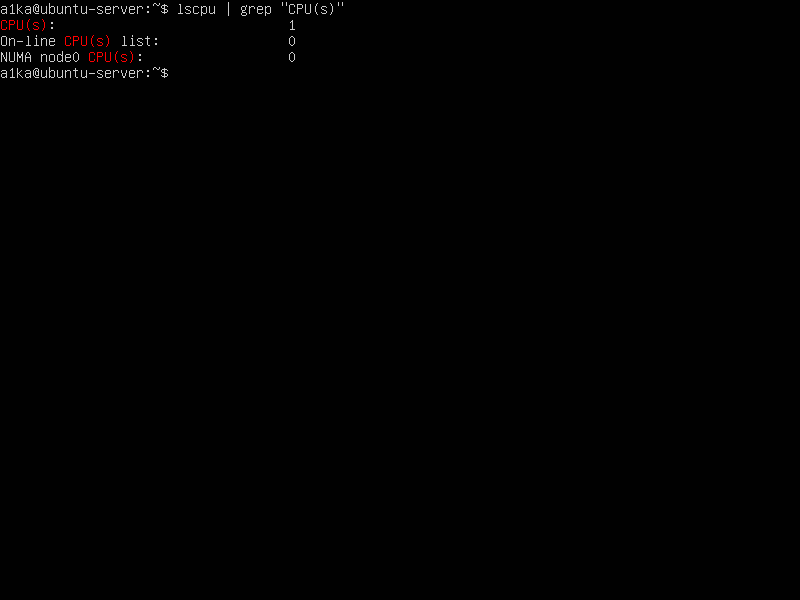
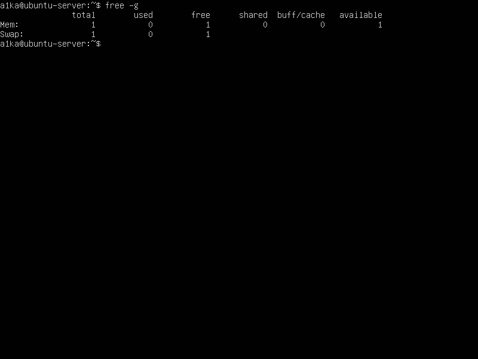
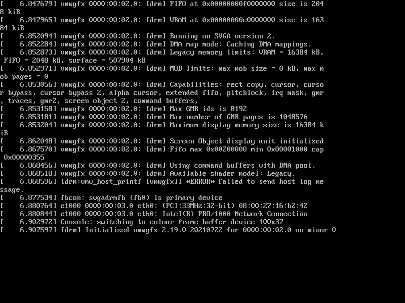
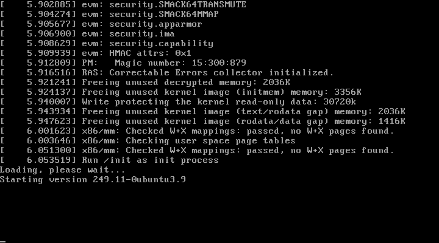
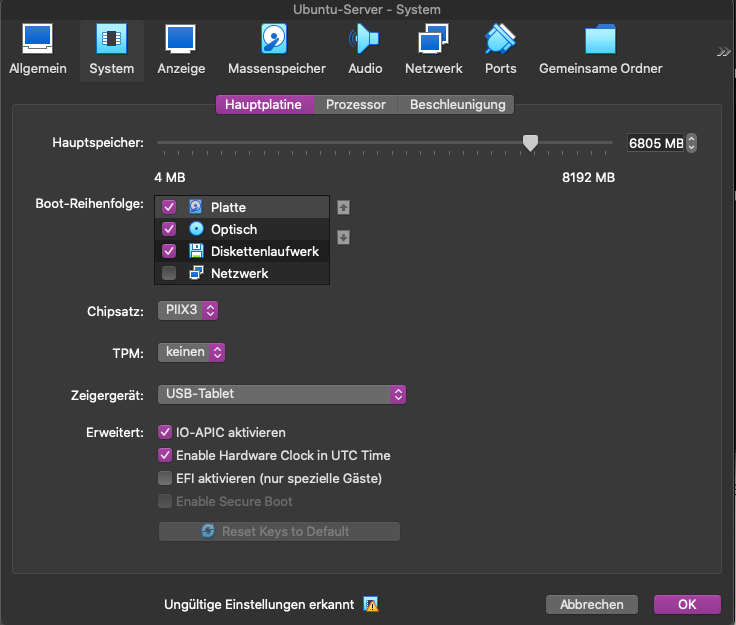

# Host Data

CPU: 2.6 GHz Quad-Core Intel Core i7
 
RAM: 8 GB 1600 MHz DDR3

# Ubuntu VM

### Description
CPU: 4 Kerne
 
RAM: 2048 MB
 
Command: lscpu | grep"CPU(s)"

### Output

### Description
CPU: 4 Kerne
 
RAM: 2048 MB
 
Command: free -g

### Output

### Description
CPU: 5 Kerne
 
RAM: 2048 MB

### Output

### Description
CPU: 4 Kerne
 
RAM: 6805 MB

### Output

bei 6805 Megabyte RAM ist es möglich zu versuchen die VM zu starten, welche anschliessend aber failed.

ab 7373 Megabyte wird die funktion die VM zu starten ausgeschaltet.s

### Explination

Dieses verhalten bezieht sich auf die verschiedenen Hypervisor typen 1 und 2.