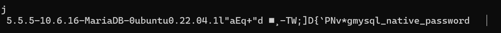

# A) Automatisierung mit Command Line Interface (CLI) (30%)

## Screenshot der Details der Instanz, die Sie stoppen und starten

## Befehle als Skript-Datei (oder die Befehle in Markdown).

Instanz stoppen:
- aws ec2 stop-instances --instance-ids i-0f4b5f73b54c02839

Instanz starten:
- aws ec2 start-instances --instance-ids i-0f4b5f73b54c02839

Instanz ersetellen:
- aws ec2 run-instances \
    --image-id ami-0c7217cdde317cfec \
    --instance-type t2.micro \
    --key-name Linus-Daniels-2 \
    --security-group-ids KN09-Sicherheitsgruppe \
    --user-data file:///Users/linusdaniels/Documents/TBZ/M346/KN09/cloud-init.yaml

##  Screenshot der Details der neu-erstellten Instanz. 

##  Screenshot telnet

## Befehle um KN05 nachzubilden

Subnetz erstellen:
- aws ec2 create-subnet --vpc-id Vpc-Id --cidr-block Subnet-Range --subnet-name KN09-Subnet

Ips Für DB und WEB Instanz aussuchen (Ips in der IP-Range des erstellten Subnetzes)

Security group erstellen:
- aws ec2 create-security-group \
    --group-name KN09-DB-Security-Group \
    --description KN09-DB-Security-Group-Desc \
    --vpc-id Vpc-Id 

- aws ec2 create-security-group \
    --group-name KN09-WEB-Security-Group \
    --description KN09-WEB-Security-Group-Desc \
    --vpc-id Vpc-Id

Security group config:
- aws ec2 authorize-security-group-ingress  \
    --group-id KN09-DB-Security-Group-Id --protocol tcp --port 3306  \
    --source-prefix-list Subnet-Range

Instanzen erstellen:
- aws ec2 run-instances \
    --image-id Ami-Id --subnet-id Subnet-Id \
    --instance-type t2.micro --key-name Key-Name \
    --security-group-ids KN09-DB-Security-Group --private-ip-address Ip-From-Subnet-Range

- aws ec2 run-instances \
    --image-id Ami-id --subnet-id Subnet-Id \
    --instance-type t2.micro --key-name Key-Name \
    --security-group-ids KN09-WEB-Security-Group --private-ip-address Ip-From-Subnet-Range

Elastic Ip erstellen:
- aws ec2 allocate-address --domain vpc

Elastic Ip zuweisen:
- aws ec2 associate-address --instance-id Instanz-Id --allocation-id Elastic-Ip-Id
